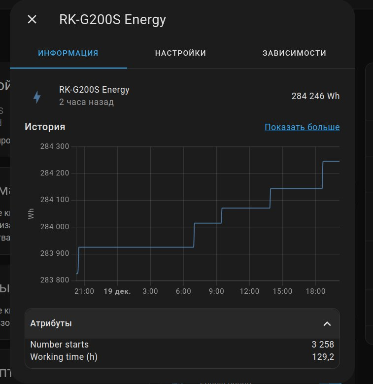

[](https://github.com/custom-components/hacs)

# Redmond SkyKettle, SkyCooker and SkyHeat series integration

Allows you to connect Redmond Kettle, Cooker, Socket and Heat to your Home Assistant.

###### _Full list of supported devices see in: [r4sconst.py](https://github.com/XNicON/hassio-r4s/blob/master/custom_components/ready4sky/r4sconst.py)_

---

## Requirements
- [Home Assistant](https://www.home-assistant.io) **2022.8+**
- [Bluetooth Component](https://www.home-assistant.io/components/bluetooth)

## Configuration
1) Enable and setting Home Assistant Bluetooth integration
2) Enable and Setting current integration


**Configuration variables:**  

| key                           | description                                                                                                                                                                                                                                                                                                                                                                                             |
|:------------------------------|:--------------------------------------------------------------------------------------------------------------------------------------------------------------------------------------------------------------------------------------------------------------------------------------------------------------------------------------------------------------------------------------------------------|
| **mac (Required)**            | Select support device (Выберите поддерживаемое устройство)                                                                                                                                                                                                                                                                                                                                              |
| **password (Required)**       | the password to your device pairing, HEX formt 8 byte (пароль для подключения к устройству, должен быть в HEX формате, длиной 8 байт, генерируется автоматически рандомный)                                                                                                                                                                                                                             |
| **scan_interval (Optional)**  | The polling interval in seconds. The default is 60. Please note that at Rasberberry it led to a load on the module and periodic dumps. You can experimentally set the time interval that suits you. (Время между опросами BLE устройства в секундах. По умолчанию 60 секунд. уменьшение интервала приводит к нагрузке, а данные которые могут приходить в реальном времени, обновляются самостоятельно) |

После указания параметров, нажмите подтвердить. Переведите устройство в режим "спаривание" и нажмите подтвердить, в следующем окне, должен произойти коннект.

## Installation instructions

En: After installation, go to the settings > integrations > plus > ready4sky.
Fill all the fields. No more need to reboot. You must see new inactive water heater, sensor and light elements. Hold down the button on the kettle until the LEDs flash rapidly.

Ru: После установки, в пользовательском интерфейсе зайдите на старицу настроек, затем в Интеграции. Там нажмите на кнопку со знаком "+" и выберите интеграцию Redmond.
Заполните все поля. Вы должны увидеть новые неактивные элементы water heater, sensor и light.
Удерживайте кнопку на чайнике до тех пор, пока светодиоды не начнут часто мигать.

### Google Home / Alexa / HomeKit / Yandex integration

create switch, simple add in ``configuration.yaml``, replace text from "< >"
```
switch:
  - platform: template
    switches:
      switch_kettle_<anyname>:
        friendly_name: "Kettle"
        value_template: "{{ states('sensor.<name sensor from HA>_status') != 'off' }}"
        turn_on:
          service: water_heater.turn_on
          target:
            entity_id: water_heater.<name sensor from HA>_kettle
        turn_off:
          service: water_heater.turn_off
          target:
            entity_id: water_heater.<name sensor from HA>_kettle
```

**Debug log enable**

add in `configuration.yaml`

```
logger:
  default: critical
  logs:
    custom_components.ready4sky: debug
    bleak.backends.bluezdbus.client: debug
```

**Screenshots**



