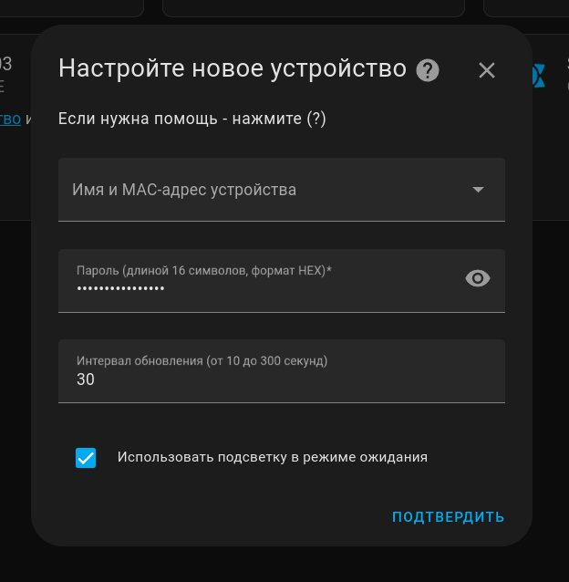
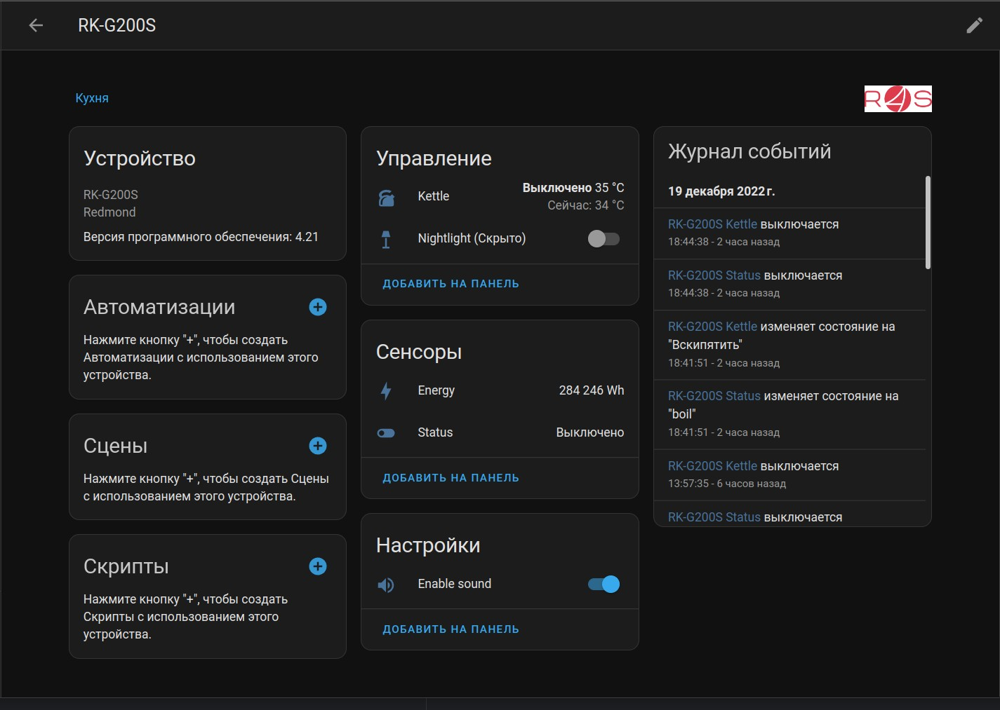
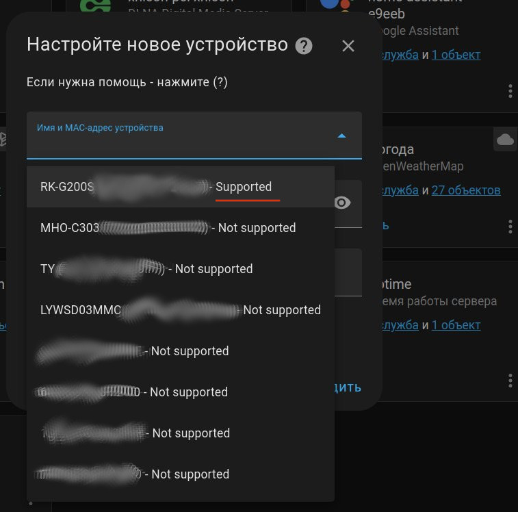
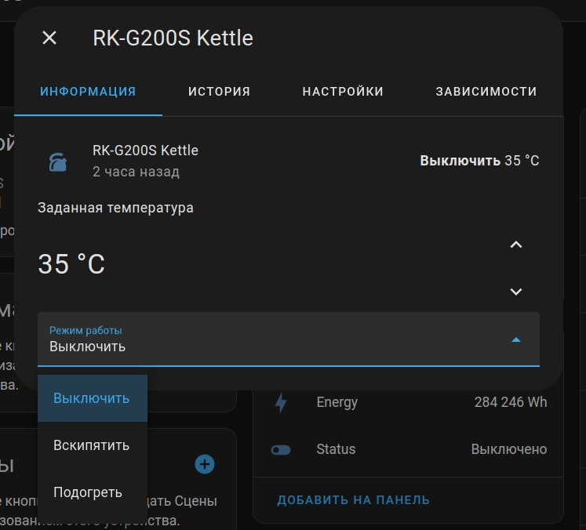

[](https://github.com/custom-components/hacs)

# Redmond SkyKettle, SkyCooker and SkyHeat series integration

Allows you to connect Redmond SkyKettle, SkyCooker and SkyHeat to your Home Assistant

Full list of supported devices see in: /custom_components/ready4sky/r4sconst.py

**Support confirmed:**
- RK-G200S - firmware v4.21

---

### Configuration:

1) Enable and setting Home Assistant Bluetooth integration
2) Setting current integration




**Configuration variables:**  
  
key | description  
:--- | :---  
**mac (Required)** | The mac address of Redmond Kettler (мак адрес чайника Redmond)
**password (Required)** | the password to your kettler, HEX formt 8 byte (пароль для подключения к чайнику, должен быть в HEX формате, длиной 8 байт), воспользуйтесь https://www.online-toolz.com/tools/text-hex-convertor.php
**scan_interval (Optional)** | The polling interval in seconds. The default is 60. Please note that at Rasberberry it led to a load on the module and periodic dumps. You can experimentally set the time interval that suits you. (Время между опросами BLE устройства в секундах. По умолчанию 60 секунд. Учтите, что на Raspberry PI  это приводило к повышению нагрузки)

После указания параметров, нажмите подтвердить. Переведите устройстро в режим "спаривание" и нажмите подтвердить, в слудующем окне, должен произойти коннект.

## Installation instructions

En: After installation, go to the settings > integrations > plus > ready4sky.
Fill all the fields. No more need to reboot. You must see new inactive water heater, sensor and light elements. Hold down the button on the kettle until the LEDs flash rapidly. Turn on redmondauthorize switch.

Ru: После установки, в пользовательском интерфейсе зайдите на старницу настроек, затем в Интеграции. Там нажмите на кнопку со знаком "+" и выберите интеграцию Redmond SkyKettle. Заполните все поля. Больше нет нужды в перезагрузке. Вы должны увидеть новые неактивные элементы water heater, sensor и light. Удерживайте кнопку на чайнике до тех пор, пока светодиоды не начнут часто мигать. Включите переключатель redmondauthorize.


**WARNING**

this configuration works out of the box with hassio. In any other configuration, you may have to make additional settings: Install modules for working with bluetooth (pybluez, bluepy), configure these modules so that they work without root privileges. (данная конфигурация работает из коробки с hassio. В любой другой конфигурации возможно придется сделать дополнительные настройки: Установить модули для работы с bluetooth (pybluez, bluepy), настроить эти модули так, чтобы они работали без прав root.)

**Screenshots**






**Google Home / Alexa / HomeKit / Yandex Alisa integration**

create switch, simple add in ``configuration.yaml``, replace text from "< >"
```
switch:
  - platform: template
    switches:
      switch_kettle_<anyname>:
        friendly_name: "Kettle"
        value_template: "{{ states('sensor.status_<name sensor from HA>') != 'off' }}"
        turn_on:
          service: water_heater.turn_on
          target:
            entity_id: water_heater.kettle_<name sensor from HA>
        turn_off:
          service: water_heater.turn_off
          target:
            entity_id: water_heater.kettle_<name sensor from HA>
```

**Debug log enable**

add in `configuration.yaml`

```
logger:
  default: critical
  logs:
    custom_components.ready4sky: debug
    bleak.backends.bluezdbus.client: debug
```


***What's new:***

2022-10-01
 - added Russian translation for statuses
 - water_heater operation split to boil and heat
 - add configuration option "sound buttons"

2022-09-23
 - use HA Bluetooth component
 - support HA 2022.9.x
 - optimizations
 - Fix #3, tnx @Sensei8

2022-07-12
 - support HA 2022.7.x
 - use bleak (remove bluepy)
 - add attributes: watts, runs, time work
 - hex password autogen
 - fix config option backlight save value

2022-07-01
- Fix connect to last firmaware protocol RK-G200S. 
- optimization and improved stability
- add errors connections logs

2021/08/04 fixed the bug https://github.com/mavrikkk/ha_kettler/issues/78.

2021/01/27 Add multi-device support (for tests, but without success).

2020/10/13 Add support for SkyHeat RCH-4529S (RFS-HPL001).

2020/05/29 Minor bug fixes and improvements. No more lags in interface, if disconnect device from power strip. states update immediatly.

2020/05/22 Minor bug fixes and improvements. +speed, +stability, -freezes. Rename r4s_kettler to ready4sky (now it is not only kettle). Delete old intefration from UI before install this!

2020/05/14 Minor bug fixes and improvements. integration some other models. add Cooker!

2020/05/06 Minor bug fixes and improvements. integration some other models. The name of the device is the model of kettle. Removed Authorize switch. Autorization is in the config flow. Turn on or turn off backlight is in the config flow

2020/04/30 Now the integration finds all the bluetooth devices during connection and offers to select it from the list. Minor bug fixes and improvements. Preparing for the integration of other models.

2020/04/24 complete revision of the code. Replacing "pexpect" library with "bluepy". Instead of an interactive mode, full support for subscribing to notifications.

2020/04/09 yaml configuration has been replaced with config flow (thanks to https://github.com/fantomnotabene). Now you can add/remove entry via UI without HA restart, able to change entity_id for each entity to your desired

2020/02/07 add switch to first authorize redmond kettler (now, you can initialize Redmond device and AFTER that connect to kettler from HA frontend), bugfixes

2020/01/27 add switch to manage "hold temperature after heat" option

2020/01/26 add switch to manage "use backlight to show current temperaure and sync statuses" option

